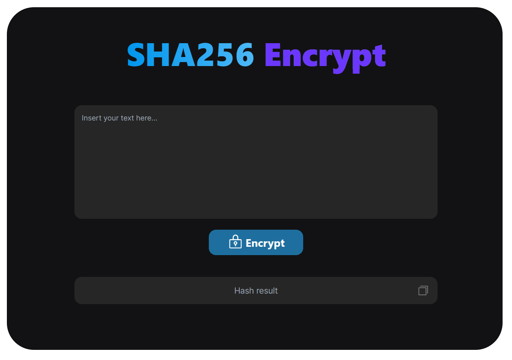

<div id="top"></div>

<!-- PROJECT LOGO -->
<br />
<div align="center">
  <a href="https://github.com/luizfranzon/discordInviteLookup">
    
  </a>

<h3 align="center">SHA256 Encrypt</h3>

  <p align="center">
    A simple SHA256 Hash generator.

</div>

<!-- ABOUT THE PROJECT -->


<hr>

### Built With

* [Vite](https://vitejs.dev/)
* [ReactJS](https://pt-br.reactjs.org/)
* [CryptoJS](https://www.npmjs.com/package/crypto-js)
* [TailwindCSS](https://tailwindcss.com/)
* [Phosphor-react](https://phosphoricons.com/)


<!-- GETTING STARTED -->
## Getting Started

**1- Clone this repository:**
```bash
git clone https://github.com/luizfranzon/react-sha256-Encrypt.git
```
**2- Install the dependencies:**
```bash
npm install
```
**3- Run the application:**
```bash
npm run dev
```
<!-- ROADMAP -->
## Roadmap

- [X] Add responsive layout
- [ ] General Improvements

<hr>

<p align="right"><a href="#top">Click to go back to top</a></p>
